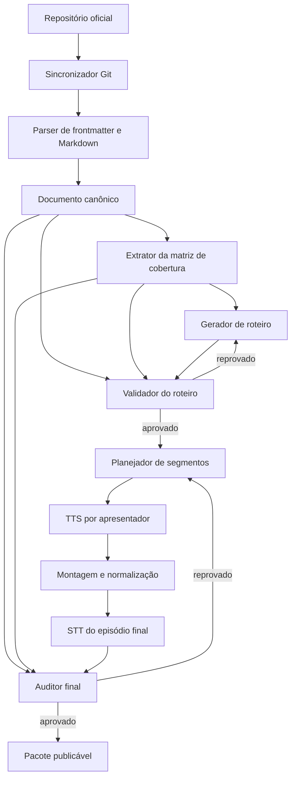

# 🎙️ Plano técnico — Akita on Rails to Podcast

> **Estado:** proposta arquitetural  
> **Atualizado em:** 18 de julho de 2026
> **Objetivo:** registrar uma solução auditável para transformar artigos em podcasts sem tratar
> resumo automático como garantia de fidelidade.

---

## 📋 Índice

- [🎯 Visão do produto](#-visão-do-produto)
- [📌 Requisitos](#-requisitos)
- [📚 Fonte dos artigos](#-fonte-dos-artigos)
- [🧠 Princípio de fidelidade](#-princípio-de-fidelidade)
- [🧰 Alternativas avaliadas](#-alternativas-avaliadas)
- [⭐ Decisão recomendada](#-decisão-recomendada)
- [🏗️ Arquitetura](#-arquitetura)
- [🧩 Componentes e responsabilidades](#-componentes-e-responsabilidades)
- [📦 Contratos de dados](#-contratos-de-dados)
- [✍️ Prompts iniciais](#-prompts-iniciais)
- [✅ Portões de qualidade](#-portões-de-qualidade)
- [🎧 Estratégia de áudio](#-estratégia-de-áudio)
- [🔌 Integração com OpenRouter](#-integração-com-openrouter)
- [💰 Estimativa de custos](#-estimativa-de-custos)
- [🛡️ Segurança e privacidade](#-segurança-e-privacidade)
- [©️ Licenciamento e atribuição](#-licenciamento-e-atribuição)
- [📊 Observabilidade e operação](#-observabilidade-e-operação)
- [🧪 Plano de MVP](#-plano-de-mvp)
- [⚠️ Riscos e mitigações](#-riscos-e-mitigações)
- [🤝 Ideias para contribuição](#-ideias-para-contribuição)
- [🏁 Critério de pronto](#-critério-de-pronto)
- [🔗 Referências](#-referências)

---

## 🎯 Visão do produto

O produto transforma artigos técnicos do **AkitaOnRails** em episódios com dois apresentadores,
preservando argumentos, exemplos, ressalvas e conclusões. A proposta não é gerar um resumo curto,
mas uma **adaptação oral verificável**.

O valor principal está no pipeline auditável:

```text
artigo original → inventário de informações → roteiro → validação → áudio → transcrição → auditoria
```

Cada episódio deve manter um pacote de proveniência com o artigo, commit de origem, matriz de
cobertura, roteiro aprovado, segmentos de áudio, transcrição e relatório final.

## 📌 Requisitos

### Requisitos funcionais

1. Descobrir artigos novos e alterados no repositório oficial.
2. Ler o Markdown em português e preservar seus metadados.
3. Separar texto editorial de navegação, shortcodes e elementos não narráveis.
4. Produzir uma matriz numerada de cobertura antes de escrever o roteiro.
5. Gerar um diálogo natural entre dois apresentadores.
6. Validar o roteiro contra o artigo antes da síntese de voz.
7. Gerar áudio em segmentos pequenos e reprocessáveis.
8. Transcrever o resultado final.
9. Auditar a transcrição contra a matriz de cobertura.
10. Publicar apenas episódios aprovados pelos portões de qualidade.

### Requisitos não funcionais

- **Idempotência:** reprocessar o mesmo commit com a mesma configuração não deve duplicar
  episódios.
- **Rastreabilidade:** toda afirmação relevante do roteiro deve apontar para um item de cobertura.
- **Substituibilidade:** modelos e provedores devem ser configuração, não regra de negócio.
- **Recuperação:** uma falha em um segmento não deve exigir gerar o episódio inteiro novamente.
- **Segurança:** tokens nunca aparecem no repositório, em logs ou relatórios.
- **Acessibilidade:** transcrição e links para o artigo acompanham todo episódio.
- **Portabilidade:** os artefatos intermediários usam formatos abertos como Markdown, JSON, WAV e
  MP3.

## 📚 Fonte dos artigos

O repositório oficial é
[`akitaonrails/akitaonrails.github.io`](https://github.com/akitaonrails/akitaonrails.github.io).
Ele é um site Hugo e armazena o conteúdo em Markdown no padrão:

```text
content/AAAA/MM/DD/slug-do-artigo/index.md       # português
content/AAAA/MM/DD/slug-do-artigo/index.en.md    # tradução em inglês, quando existir
```

Na verificação de 16 de julho de 2026, a árvore continha aproximadamente:

- 771 artigos em português;
- 398 traduções em inglês;
- publicações desde 2006;
- metadados como título, data, slug, tags, rascunho e chave de tradução.

### Estratégia de sincronização

1. Clonar o repositório com Git.
2. Registrar o commit processado.
3. Em execuções seguintes, fazer `git fetch` e comparar commits.
4. Selecionar somente `index.md` novos ou modificados.
5. Ignorar `draft: true`.
6. Calcular um hash do conteúdo normalizado e da configuração do pipeline.

Git é preferível a scraping porque oferece conteúdo limpo, histórico, detecção incremental de
mudanças e proveniência por commit.

## 🧠 Princípio de fidelidade

"Não perder informação" não deve significar leitura literal de cada caractere. Código, URLs,
tabelas e repetições podem exigir adaptação oral. O contrato correto é:

> Não omitir nem distorcer conceitos, argumentos, exemplos, ressalvas, evidências, números e
> conclusões necessários para reconstruir o sentido do artigo.

Esse contrato vale para **podcast adaptado**. O produto também possui **leitura fiel**, voltada a
prosa pronta como livros e fanfics: nesse modo, nenhum modelo pode produzir o texto falado. O
backend divide o original localmente e exige que a concatenação dos trechos seja idêntica à
entrada; a IA devolve somente direções prosódicas separadas.

### Classes de cobertura

| Classe | Exemplo | Regra |
|---|---|---|
| Crítica | tese, conclusão, ressalva que limita uma afirmação | cobertura integral obrigatória |
| Importante | exemplo central, número, comparação, referência técnica | cobertura integral obrigatória |
| Contextual | transição, repetição, observação lateral | pode ser condensada sem mudar o sentido |
| Não narrável | HTML visual, navegação, sintaxe repetitiva | descrever a função ou disponibilizar nas notas |

Nenhum modelo deve aprovar sozinho a própria saída. Geração e auditoria devem usar chamadas
separadas e, quando viável, modelos ou prompts independentes.

## 🧰 Alternativas avaliadas

### NotebookLM pessoal

**Vantagens**

- gera rapidamente uma conversa natural com dois apresentadores;
- aceita Markdown e português;
- possui plano gratuito e planos pessoais com limites maiores;
- é excelente para descobrir o estilo desejado.

**Limitações**

- Audio Overview é definido pelo Google como resumo aprofundado;
- não garante cobertura integral;
- a assinatura Google AI Plus/Pro não oferece API do NotebookLM pessoal;
- o fluxo de geração e download é manual.

**Uso recomendado:** protótipo editorial e referência de qualidade de conversa.

### NotebookLM Enterprise

**Vantagens**

- permite criar notebooks, adicionar fontes e solicitar Audio Overviews por API;
- oferece controles de IAM, região e proteção empresarial;
- permite selecionar fontes, idioma e foco do episódio.

**Limitações**

- é um produto separado da assinatura pessoal;
- a API de Audio Overview está em Preview;
- a referência pública expõe criação e remoção, enquanto o download continua documentado
  pela interface Studio;
- continua produzindo um resumo, sem expor um roteiro auditável antes do áudio.

**Uso recomendado:** ambientes empresariais que já adotem NotebookLM Enterprise, não como base
do MVP aberto.

### Podcast API do Google

A API independente gerava podcasts em lote e devolvia MP3, mas foi descontinuada e não aceita
novos clientes. Não deve ser uma dependência do projeto.

### Gemini API + Gemini TTS direto

**Vantagens**

- gera roteiro controlado e áudio com até duas vozes;
- permite controlar ritmo, estilo e tom;
- o TTS é adequado para recitação de texto definido;
- possui preços previsíveis por token.

**Limitações**

- exige conta de faturamento separada da assinatura pessoal;
- cria acoplamento maior ao Google se a integração não for abstraída;
- saídas longas precisam ser segmentadas para evitar deriva de voz.

### OpenRouter

**Vantagens**

- uma API para modelos de texto, TTS e STT;
- endpoints compatíveis com SDKs OpenAI;
- permite trocar modelos e provedores por configuração;
- fornece custos por requisição e histórico de uso;
- oferece modelos como Gemini TTS, Voxtral, MAI-Voice, Kokoro, Orpheus e outros.

**Limitações**

- a qualidade em português varia por modelo e precisa de teste;
- recursos específicos do provedor podem não existir no contrato padronizado;
- o endpoint TTS portável documenta uma voz por requisição;
- a compra de créditos possui taxa de plataforma.

## ⭐ Decisão recomendada

Usar **OpenRouter como borda principal**, atrás de interfaces internas pequenas:

```text
TextModel
TextToSpeech
SpeechToText
```

A regra de negócio não deve importar SDKs de provedores. Um adaptador OpenRouter implementa as
interfaces iniciais; adaptadores diretos para Gemini ou outro provedor podem ser adicionados sem
alterar ingestão, cobertura, roteiro ou auditoria.

O Gemini 3.1 Flash TTS via OpenRouter é um bom primeiro candidato por suportar português, controle
expressivo e até dois falantes no modelo. Como o endpoint TTS padronizado recebe uma voz por
requisição, o MVP deve funcionar com turnos separados e tratar multivoz nativo como otimização
dependente de teste de passthrough.

## 🏗️ Arquitetura



### Fronteiras

- **Domínio:** artigo, cobertura, roteiro, segmentos, auditoria e aprovação.
- **Aplicação:** coordenação do pipeline e políticas de retry.
- **Infraestrutura:** Git, sistema de arquivos, OpenRouter, `ffmpeg` e publicação.
- **Interface:** menu `start_app.py`, CLI interna e relatórios.

## 🧩 Componentes e responsabilidades

### Sincronizador Git

- clona ou atualiza o repositório oficial;
- identifica arquivos alterados entre dois commits;
- registra commit, caminho e hash;
- nunca modifica o repositório de origem.

### Parser de artigo

- valida frontmatter;
- ignora rascunhos;
- interpreta headings, parágrafos, listas, citações, tabelas e código;
- preserva links e a localização aproximada de cada bloco;
- converte shortcodes conhecidos para representação canônica;
- sinaliza elementos desconhecidos em vez de descartá-los silenciosamente.

### Extrator de cobertura

- atribui identificadores estáveis como `C001`;
- classifica criticidade;
- registra evidência textual e seção de origem;
- separa fatos do artigo, opiniões atribuídas ao autor e contexto editorial.

### Gerador de roteiro

- produz turnos para dois apresentadores;
- preserva ordem e encadeamento do artigo quando isso melhora a fidelidade;
- marca cada turno com os itens de cobertura atendidos;
- não adiciona fatos externos sem um rótulo explícito;
- adapta código e elementos visuais para explicação oral.

### Validador do roteiro

- compara artigo, matriz e roteiro;
- classifica itens como completos, parciais, ausentes ou distorcidos;
- bloqueia o TTS quando houver falha crítica;
- gera correções localizadas, não uma reescrita cega do episódio inteiro.

### Planejador de segmentos

- divide o roteiro por capítulo e turno;
- limita a duração estimada de cada requisição;
- escolhe voz, estilo, pausa inicial e pausa final;
- gera IDs determinísticos para cache e reprocessamento.

### Planejador de leitura fiel

- divide prosa por parágrafo ou fim de frase, com corte duro somente quando necessário;
- comprova que os trechos recompõem o texto original sem remoção ou reordenação;
- analisa lotes limitados, sem exigir que a obra completa caiba no contexto do modelo;
- aceita do modelo somente direção de ritmo, pausa, emoção, tensão e diálogo;
- persiste `prosody.json` e `narration-script.json` para retomada e auditoria.

### Adaptador TTS

- chama `/api/v1/audio/speech`;
- grava bytes de áudio atomicamente;
- valida formato, duração mínima e resposta não vazia;
- registra modelo, provedor, voz, custo e identificador da geração;
- permite regenerar um único segmento.

### Montador de áudio

- concatena segmentos com `ffmpeg`;
- insere pausas controladas;
- normaliza loudness;
- inclui metadados do episódio;
- produz um arquivo intermediário sem perdas e um MP3 de distribuição.

### Adaptador STT e auditor final

- chama `/api/v1/audio/transcriptions`;
- obtém a transcrição do arquivo montado, não dos textos enviados ao TTS;
- detecta fala truncada, troca indevida de voz e pronúncia que altere termos;
- compara novamente todos os itens de cobertura;
- produz relatório legível e JSON estruturado.

## 📦 Contratos de dados

### Artigo canônico

```json
{
  "article_id": "2026-06-14/exemplo-de-slug",
  "source_path": "content/2026/06/14/exemplo-de-slug/index.md",
  "source_commit": "<commit-sha>",
  "title": "Título do artigo",
  "published_at": "2026-06-14T14:00:00-03:00",
  "canonical_url": "https://akitaonrails.com/AAAA/MM/DD/slug/",
  "language": "pt-BR",
  "tags": ["exemplo"],
  "content_hash": "<sha256>",
  "sections": []
}
```

### Item de cobertura

```json
{
  "id": "C001",
  "section_id": "S001",
  "kind": "argumento",
  "criticality": "critica",
  "statement": "Descrição autocontida do que precisa ser preservado.",
  "evidence": "Trecho curto do artigo para auditoria interna.",
  "source_locator": {
    "heading": "Nome da seção",
    "block_index": 3
  }
}
```

### Turno do roteiro

```json
{
  "turn_id": "T001",
  "speaker": "apresentador_a",
  "text": "Texto que será falado.",
  "coverage_ids": ["C001", "C002"],
  "delivery": {
    "tone": "curioso",
    "pace": "normal"
  }
}
```

### Trecho de leitura fiel

```json
{
  "turn_id": "N00001",
  "speaker": "narrador",
  "text": "Fatia exata do texto original.",
  "instructions": "Direção vocal separada; nunca é lida como texto."
}
```

### Resultado de auditoria

```json
{
  "coverage_id": "C001",
  "status": "completo",
  "transcript_evidence": "Trecho correspondente da transcrição.",
  "notes": "",
  "required_correction": null
}
```

Os contratos devem ser versionados. Mudança incompatível exige nova versão de schema e migração
explícita dos artefatos persistidos.

## ✍️ Prompts iniciais

Prompts devem viver como arquivos versionados, receber entradas delimitadas e retornar saída
estruturada validada por schema. Os textos abaixo são pontos de partida, não strings para ficar
espalhadas pelo código.

### Extração da matriz de cobertura

```text
Analise somente o artigo delimitado abaixo.

Crie um inventário que permita verificar se uma adaptação em áudio preservou o sentido integral.
Inclua teses, argumentos, etapas de raciocínio, exemplos, números, ressalvas, contrapontos,
referências e conclusões. Diferencie opinião atribuída ao autor de fato descrito no texto.

Para cada item, retorne ID, seção, tipo, criticidade, afirmação autocontida e evidência curta.
Não acrescente conhecimento externo. Não descarte uma informação por parecer repetitiva sem
registrar a decisão como contextual.

Retorne JSON válido conforme o schema fornecido.

<artigo>
{{ARTICLE_MARKDOWN}}
</artigo>
```

### Geração do roteiro

```text
Produza uma adaptação integral em diálogo entre dois apresentadores.

O roteiro deve cobrir todos os itens críticos e importantes da matriz. Preserve o grau de certeza,
o ponto de vista e as ressalvas do artigo. Os apresentadores podem reformular para criar uma
conversa natural, mas não podem inventar fatos nem atribuir ao autor algo que ele não afirmou.

Quando houver código, explique sua finalidade e os trechos essenciais. Quando houver elemento
visual, descreva somente o necessário para compreender o argumento. Não imponha duração fixa.

Cada turno deve listar os IDs de cobertura atendidos. Retorne JSON válido conforme o schema.

<artigo>{{ARTICLE_MARKDOWN}}</artigo>
<matriz>{{COVERAGE_MATRIX}}</matriz>
```

### Auditoria do roteiro ou transcrição

```text
Compare a adaptação com o artigo e a matriz de cobertura.

Para cada item, classifique como completo, parcial, ausente ou distorcido. Um tema apenas
mencionado não conta como completo: argumento, exemplo e ressalva precisam manter o sentido.
Identifique também afirmações sem sustentação no artigo.

Retorne evidência da adaptação, explicação objetiva e correção necessária. Não reescreva partes
já aprovadas. Retorne JSON válido conforme o schema.
```

## ✅ Portões de qualidade

### Antes do TTS

- 100% dos itens críticos com status `completo`;
- 100% dos itens importantes com status `completo`;
- nenhum item `distorcido`;
- nenhum fato externo não identificado como contexto adicional;
- nomes, números, links e termos técnicos conferidos;
- duração estimada compatível com o volume do artigo.

Na leitura fiel, os portões editoriais acima são substituídos por igualdade integral entre
entrada e concatenação dos trechos, uma única voz válida, instruções curtas e ids determinísticos.

### Depois do TTS

- mesmos critérios de cobertura aplicados à transcrição;
- nenhum segmento vazio ou truncado;
- ordem dos segmentos preservada;
- vozes consistentes com os apresentadores;
- loudness e picos dentro da política definida pelo projeto;
- atribuição falada e escrita presente;
- arquivo final reproduzível e metadados corretos.

### Revisão humana

No MVP, uma pessoa deve revisar integralmente os primeiros episódios. Depois que as métricas
mostrarem estabilidade, a revisão pode migrar para amostragem, mantendo revisão obrigatória em:

- artigos com alta densidade de código ou matemática;
- episódios com regenerações repetidas;
- divergência entre dois auditores;
- conteúdo que cite pessoas, acusações ou temas sensíveis.

## 🎧 Estratégia de áudio

### Duração adaptativa

Não deve existir limite rígido de 30 minutos.

| Tamanho editorial | Duração indicativa |
|---|---:|
| Artigo curto | 10–15 minutos |
| Artigo médio | 20–30 minutos |
| Artigo longo | 35–45 minutos ou partes |

A duração resulta da cobertura. Se a conversa ficar artificialmente longa, o gerador pode
condensar itens contextuais, nunca itens críticos ou importantes.

### Segmentação

- preferir segmentos de 30 a 120 segundos;
- não cortar no meio de uma frase;
- manter pequenos contextos de entrada e saída para entonação;
- inserir pausas na montagem, não depender de silêncio aleatório do modelo;
- guardar WAV/PCM intermediário para evitar recompressões sucessivas;
- gerar MP3 somente na etapa de distribuição.

### Dois apresentadores

O contrato portável usa uma voz por chamada TTS:

```text
turno A1 → voz A
turno B1 → voz B
turno A2 → voz A
turno B2 → voz B
```

O suporte multivoz nativo do modelo pode reduzir chamadas e melhorar continuidade, mas deve ser
uma capacidade opcional do adaptador. O pipeline não pode depender dela para funcionar.

## 🔌 Integração com OpenRouter

### Endpoints

| Responsabilidade | Endpoint |
|---|---|
| geração e auditoria textual | `/api/v1/chat/completions` |
| síntese de voz | `/api/v1/audio/speech` |
| transcrição | `/api/v1/audio/transcriptions` |
| descoberta de modelos TTS | `/api/v1/models?output_modalities=speech` |

### Seleção de modelos

Os modelos abaixo estavam disponíveis na pesquisa de 16 de julho de 2026. A aplicação deve
consultar capacidades e preços ou manter configuração atualizável; nomes não devem ser constantes
espalhadas no domínio.

| Uso | Candidato inicial | Motivo |
|---|---|---|
| cobertura e validação | modelo textual eficiente com JSON estruturado | custo baixo e alta repetibilidade |
| roteiro | modelo textual de maior qualidade | naturalidade e preservação de nuance |
| TTS em português | `google/gemini-3.1-flash-tts-preview` | 70+ idiomas e suporte de modelo a dois falantes |
| TTS alternativo | Voxtral ou MAI-Voice | comparação de custo e naturalidade |
| STT | modelo com suporte explícito a português | auditoria do arquivo real |

### Política de fallback

Fallback automático é aceitável para extração e auditoria quando o contrato JSON for preservado.
Para TTS, trocar o modelo silenciosamente pode mudar a identidade sonora; o fallback deve exigir
uma voz previamente homologada ou deixar o episódio pendente.

### Resiliência

- timeout por etapa;
- retry com backoff e jitter para erros transitórios;
- limite de tentativas;
- circuit breaker por provedor;
- validação do `Content-Type` antes de salvar áudio;
- gravação em arquivo temporário seguida de rename atômico;
- cache por hash de texto, modelo, voz e configuração;
- orçamento máximo por episódio.

## 💰 Estimativa de custos

> Valores pesquisados em 16 de julho de 2026. Preços de modelos e câmbio mudam; a aplicação
> deve exibir uma estimativa antes de iniciar um lote. Conversões para reais abaixo usam apenas a
> hipótese ilustrativa de `US$ 1 = R$ 5,50`, sem impostos.

### Gemini 2.5 Flash TTS direto

O preço oficial pesquisado era US$ 0,50 por milhão de tokens de texto e US$ 10 por milhão de
tokens de áudio. Como o Google documenta 25 tokens de áudio por segundo, o custo de voz equivale
a aproximadamente US$ 0,015 por minuto.

| Duração | Somente voz | Pipeline estimado | Conversão ilustrativa |
|---:|---:|---:|---:|
| 15 min | US$ 0,23 | US$ 0,26–0,33 | R$ 1,43–1,82 |
| 25 min | US$ 0,38 | US$ 0,41–0,48 | R$ 2,26–2,64 |
| 30 min | US$ 0,45 | US$ 0,48–0,55 | R$ 2,64–3,03 |
| 45 min | US$ 0,68 | US$ 0,71–0,78 | R$ 3,91–4,29 |

"Pipeline" inclui uma estimativa para matriz, roteiro, auditoria e transcrição. Regenerações,
impostos, armazenamento e distribuição não estão incluídos.

### Gemini 3.1 Flash TTS pelo OpenRouter

O modelo estava listado a US$ 1 por milhão de tokens de entrada e US$ 20 por milhão de tokens de
saída de áudio. Um episódio de 30 minutos fica perto de US$ 0,90 somente em voz e de US$ 1,00–1,10
com as etapas textuais e de auditoria.

O OpenRouter informa que repassa o preço do provedor sem margem sobre inferência, mas cobra 5,5%
na compra de créditos, com valor mínimo de US$ 0,80 por compra.

### Acervo completo

Para 771 artigos e uma hipótese conservadora de 25 minutos por episódio:

- duração total aproximada: 321 horas;
- Gemini 2.5 Flash TTS direto: cerca de US$ 289 somente em voz;
- texto, STT e auditoria: aproximadamente US$ 30–70;
- reserva de 20% para regenerações;
- ordem de grandeza total: US$ 330–400.

Esse número é um cenário de planejamento, não uma previsão: muitos artigos antigos podem gerar
episódios menores. O MVP deve medir custo real por mil palavras e por minuto aprovado antes de
autorizar processamento em massa.

### NotebookLM

- plano gratuito: três Audio Overviews por dia;
- Google AI Plus: seis por dia, por assinatura pessoal;
- Google AI Pro: limites maiores;
- nenhum deles transforma a assinatura pessoal em crédito da Gemini API.

O custo marginal por episódio pode ser zero dentro da assinatura, mas o trabalho é manual e não
oferece o mesmo controle de cobertura.

## 🛡️ Segurança e privacidade

- carregar chaves por variáveis de ambiente ou cofre de segredos;
- fornecer `.env.example` somente com nomes de variáveis e valores vazios;
- nunca persistir `Authorization`, tokens ou corpo integral de erro do provedor;
- mascarar IDs sensíveis em relatórios compartilháveis;
- definir limite de gasto na chave e no próprio pipeline;
- verificar política de retenção e treinamento do provedor selecionado;
- desabilitar provedores incompatíveis com a política de dados do projeto;
- tratar Markdown e HTML do repositório como entrada não confiável;
- nunca executar código, scripts ou comandos encontrados dentro de um artigo;
- impedir que instruções presentes no conteúdo substituam o prompt de sistema.

## ©️ Licenciamento e atribuição

O README do repositório do blog declara **CC BY-NC-SA 4.0**. Essa licença permite compartilhar e
adaptar o material sob condições que incluem:

- atribuição adequada;
- link para a licença;
- indicação das modificações;
- uso não comercial;
- distribuição da adaptação sob a mesma licença.

Para monetização, patrocínio, assinatura ou outro uso comercial, é prudente obter autorização
expressa do titular. A descrição aqui é um requisito de projeto, não aconselhamento jurídico.

### Atribuição mínima do episódio

```text
Baseado no artigo "<título>", de Fabio Akita, publicado em AkitaOnRails.com.
Adaptação em áudio gerada com inteligência artificial e revisada conforme o relatório de
cobertura do episódio. Texto original disponível em <URL>, sob CC BY-NC-SA 4.0.
Esta adaptação é distribuída sob CC BY-NC-SA 4.0.
```

Essa atribuição deve aparecer:

- no início ou final do áudio;
- nos metadados e na descrição do episódio;
- no feed RSS;
- junto da transcrição.

A licença MIT da aplicação não deve ser apresentada como licença dos artigos ou podcasts
derivados. Código, fontes importadas e artefatos derivados precisam ficar claramente separados.

## 📊 Observabilidade e operação

### Estados do episódio

```text
descoberto
  → normalizado
  → cobertura_extraida
  → roteiro_em_revisao
  → roteiro_aprovado
  → audio_em_geracao
  → audio_montado
  → auditoria_final
  → aprovado | bloqueado
  → publicado
```

### Métricas

- custo por artigo, mil palavras e minuto aprovado;
- tokens de texto e áudio por etapa;
- taxa de aprovação do primeiro roteiro;
- itens ausentes, parciais e distorcidos por modelo;
- segmentos regenerados por episódio;
- tempo de processamento por etapa;
- divergência entre roteiro e transcrição;
- falhas por provedor e modelo;
- cache hits e custo evitado.

### Logs

Logs devem ser estruturados e registrar IDs internos, etapa, modelo, duração, tentativas e custo.
Não devem registrar tokens, headers, artigo integral ou respostas completas quando metadados forem
suficientes para diagnóstico.

## 🧪 Plano de MVP

### Fase 0 — experimento editorial

- selecionar três artigos curto, médio e longo;
- gerar Audio Overviews manualmente no NotebookLM;
- registrar o que foi omitido e quais características tornam o diálogo natural;
- definir vozes e tom desejados.

### Fase 1 — ingestão reproduzível

- sincronizar o repositório oficial;
- analisar frontmatter e Markdown;
- persistir artigo canônico e proveniência;
- testar casos com código, imagens, HTML e shortcodes.

### Fase 2 — roteiro auditável

- implementar matriz de cobertura;
- gerar roteiro estruturado;
- validar schemas;
- bloquear omissões e distorções antes do TTS.

### Fase 3 — áudio com dois apresentadores

- integrar OpenRouter TTS;
- gerar turnos com duas vozes;
- montar e normalizar segmentos;
- permitir reprocessamento localizado.

### Fase 4 — auditoria do arquivo final

- integrar STT;
- comparar transcrição com matriz;
- gerar relatório de cobertura;
- executar revisão humana dos episódios piloto.

### Fase 5 — operação segura

- adicionar orçamento, filas locais e retomada;
- implementar menu `start_app.py` conforme o padrão do projeto;
- gerar feed e metadados de atribuição;
- processar um lote pequeno antes de considerar o acervo completo.

### Estrutura proposta

```text
Akita-On-Rails-to-Podcast/
├── 📁 src/
│   └── 📁 akita_podcast/
│       ├── 📁 domain/          # Entidades e políticas puras
│       ├── 📁 application/     # Casos de uso do pipeline
│       ├── 📁 infrastructure/  # Git, OpenRouter, ffmpeg e arquivos
│       └── 📁 prompts/         # Prompts versionados
├── 📁 tests/
│   ├── 📁 unit/
│   ├── 📁 integration/
│   └── 📁 fixtures/
├── 📁 docs/
├── 📁 data/                    # Artefatos locais ignorados pelo Git
├── .env.example
├── start_app.py             # Menu interativo obrigatório
├── IA.md                    # Linha do tempo de decisões
└── README.md
```

Essa estrutura é uma proposta para a fase de implementação. Ela deve ser confirmada contra a
stack escolhida, sem criar camadas que ainda não tenham responsabilidade concreta.

## ⚠️ Riscos e mitigações

| Risco | Impacto | Mitigação |
|---|---|---|
| Omissão no roteiro | perda do objetivo central | matriz de cobertura e bloqueio pré-TTS |
| Alucinação | atribuição falsa ao autor | auditor independente e proibição de fatos externos |
| Erro de voz ou truncamento | episódio incompleto | segmentação, STT final e reprocessamento localizado |
| Mudança de preço/modelo | custo imprevisível | adaptadores, descoberta de modelos e orçamento por lote |
| Mudança na estrutura do blog | falha de ingestão | parser validado e erro explícito para bloco desconhecido |
| Prompt injection no artigo | desvio do pipeline | delimitação, schema e tratamento como dado não confiável |
| Uso comercial incompatível | risco de licença | operação não comercial ou autorização expressa |
| Dependência do OpenRouter | indisponibilidade | interfaces internas e adaptador direto alternativo |
| Custo do acervo inteiro | gasto antes de validar qualidade | pilotos, métricas e liberação de lote por orçamento |
| Revisão apenas por IA | falso positivo de qualidade | revisão humana inicial e amostragem posterior |

## 🤝 Ideias para contribuição

- criar um corpus de pronúncia de termos técnicos em português;
- comparar Gemini TTS, Voxtral, MAI-Voice e alternativas abertas;
- definir uma métrica reproduzível de cobertura semântica;
- construir fixtures representativas de Markdown Hugo;
- adicionar validação humana simples para itens controversos;
- gerar capítulos e notas do episódio a partir da matriz;
- publicar relatórios de cobertura junto dos episódios;
- explorar cache compartilhado e processamento batch;
- melhorar acessibilidade da transcrição;
- documentar permissão adicional caso o projeto evolua para uso comercial.

## 🏁 Critério de pronto

Um MVP está pronto quando consegue processar os três artigos piloto e demonstrar:

- ingestão reproduzível a partir de commit conhecido;
- matriz de cobertura revisável;
- roteiro aprovado sem itens críticos ou importantes ausentes;
- duas vozes consistentes;
- retomada depois de falha em um segmento;
- transcrição e auditoria do MP3 final;
- atribuição e licença corretas;
- custo real registrado;
- nenhum segredo em arquivos ou logs;
- instruções de execução e limitações atualizadas.

Antes de processar o acervo, o projeto também precisa definir um limiar de qualidade aceito por
revisão humana e um limite financeiro explícito.

## 🔗 Referências

### Conteúdo e licença

- [Repositório oficial AkitaOnRails](https://github.com/akitaonrails/akitaonrails.github.io)
- [Creative Commons BY-NC-SA 4.0](https://creativecommons.org/licenses/by-nc-sa/4.0/)

### NotebookLM e Google

- [Gerar Audio Overview no NotebookLM](https://support.google.com/notebooklm/answer/16212820)
- [Fontes aceitas pelo NotebookLM](https://support.google.com/notebooklm/answer/16215270)
- [Limites e planos do NotebookLM](https://support.google.com/notebooklm/answer/16213268)
- [NotebookLM Enterprise](https://docs.cloud.google.com/gemini/enterprise/notebooklm-enterprise/docs/overview)
- [API de Audio Overview](https://docs.cloud.google.com/gemini/enterprise/notebooklm-enterprise/docs/api-audio-overview)
- [Podcast API descontinuada](https://docs.cloud.google.com/gemini/enterprise/notebooklm-enterprise/docs/podcast-api)
- [Gemini TTS](https://ai.google.dev/gemini-api/docs/speech-generation)
- [Preços da Gemini API](https://ai.google.dev/gemini-api/docs/pricing)
- [Preços do Google Cloud Text-to-Speech](https://cloud.google.com/text-to-speech/pricing)

### OpenRouter

- [Documentação de TTS](https://openrouter.ai/docs/guides/overview/multimodal/tts)
- [Documentação de STT](https://openrouter.ai/docs/guides/overview/multimodal/stt)
- [Gemini 3.1 Flash TTS no OpenRouter](https://openrouter.ai/google/gemini-3.1-flash-tts-preview)
- [FAQ de preços e privacidade](https://openrouter.ai/docs/faq)

---

Este documento deve evoluir como registro vivo. Decisões futuras devem indicar o que mudou, por
que mudou, como foi validado e qual risco permaneceu.
